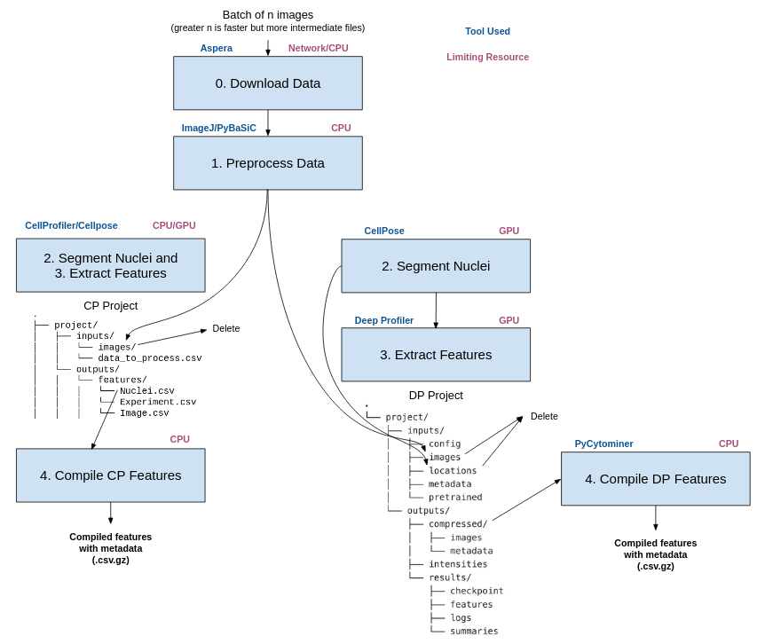

# idrstream

Software for feature extraction from IDR image data!

Idrstream is a package for deriving features associated with metadata from microscopy-image data hosted on [IDR](https://idr.openmicroscopy.org/).

The typical image-based cell profiling workflow includes many steps such as downloading images, preprocessing these images, segmenting the cells in these images, and extracting features from these cells. 
However, it is difficult to process entire microscopy-image datasets in these workflows as the image data from these datasets are often several terabytes in size. 
These workflows need even more disk space than just the size of the image data: intermediate files are used throughout the process to store information about cell location, metadata etc.

Idrstream completes this workflow in batches such that the disk space needed for image data and intermediate files is reduced.
In this way, idrstream "streams" all the steps of a profiling workflow and saves valuable disk space!
Only the features extracted from the images (as well as the metadata for the features) have a permanent spot on the hard drive.

## About

Idrstream uses the following tools to process data:

- [Aspera](https://www.ibm.com/products/aspera) high-speed transfer client is used to download IDR data.
More details can be found on the [IDR website](https://idr.openmicroscopy.org/about/download.html) and in setup/usage sections.
- [Fiji](https://imagej.net/software/fiji/) is used with [PyImagej](https://github.com/imagej/pyimagej) to read mitosis movies, which are hosted on IDR in [CellH5](https://github.com/CellH5/cellh5) format.
- [BaSiCPy](https://github.com/peng-lab/BaSiCPy) is used to perform illumination correction on images.
BaSiCPy is the python implementation of the BaSiC method for illumination correction, introduced in [Peng, T et al., 2020](https://doi.org/10.1007/978-3-030-59722-1_17).
- [CellPose](https://github.com/mouseland/cellpose) is used to segment nuclei from mitosis movies.
CellPose was first introduced in [Stringer, C., Wang, T., Michaelos, M. et al., 2020](https://doi.org/10.1038/s41592-020-01018-x).
- [DeepProfiler](https://github.com/cytomining/DeepProfiler) can be used to extract deep learning features from mitosis movies. 
- [CellProfiler](https://github.com/CellProfiler/CellProfiler) can be used for segmentation and traditional feature extraction from mitosis movies. 
- [PyCytominer](https://github.com/cytomining/pycytominer) is used to compile DeepProfiler-extracted features with their metadata. 

The stream processes image data in the following pipeline:



The stream is set up as follows:

1) Create the temporary final data directories (if they don't already exist).
Depending on the type of project you plan to use, either a CellProfiler (CP) or Deep Profiler (DP) project folder is also created in the temporary directory.
2) Initialize downloader.
The Aspera downloader needs to be initialized with information about Aspera and the screens being downloaded (see example usage for more information).
3) Initialize preprocessor.
The ImageJ preprocessor needs to be initalized with information about ImageJ (see example usage for more information).

**For Deep Profiler Project:**

4) Initialize segmentor.
The CellPose segmentor needs to be initialized with information about the CellPose model specifications (see example usage for more information).
5) Create the base DP project folders/files.
Every DP batch run will use 2 files: config and checkpoint (examples in [example_files/DP_files](example_files/DP_files)).
These files are copied to their necessary folders in the DP project and will not be deleted until the stream is complete.
In other words, these are the only files that persist in the temporary directory for the entirety of a stream.
6) Start the stream.
The stream is given a batch size that corresponds to how many images the stream should process in each batch.
A DP project is run for each batch and the locations and images for each DP run are saved as intermediate files.
The larger the batch size, the faster a stream will complete (DP will not need to be initialized as often).
However, a larger batch size also corresponds to more intermediate files and more memory being allocated at once by DP (step 3) and PyCytominer (step 4).

**For CellProfiler Project:**

4) Initialize cp_metadata.
`idrstream.CellProfilerRun().convert_tsv_to_csv()` needs to be used to initialize metadata for CellProfiler use.
Check [example_cp.ipynb](example_notebooks/example_cp.ipynb) for more info.
5) Create the base CP project folders/files.
Every CP batch run will use 1 file: `.cppipe` file (example in [example_files/CP_files](example_files/CP_files)).
This file is copied to the necessary folders in the CP project (e.g. inputs/pipeline) and will not be deleted until the stream is complete.
In other words, this is the only file that persists in the temporary directory for the entirety of a stream.
6) Start the stream.
The stream is given a batch size that corresponds to how many images the stream should process in each batch.
A CP project is run for each batch and images for each CP run are saved as intermediate files.

Once a stream is set up, it processes each batch as follows for a **DP project**:
1) Download a movie to temporary directory (step 0).
2) Find desired frame(s) and perform illumination correction.
Save desired frame(s) in DP project (step 1).
3) Find nuclei locations in desired frame(s) and save these nuclei locations in DP project (step 2).
4) Compile an `index.csv` file for the batch.
Each DP run needs this file to understand the metadata (plate, well, pertubation) associated with the image.
Save `index.csv` file in DP project (step 2.5).
5) Profile all images in batch with DeepProfiler.
Features from this DP run are saved in DP project (step 3).
6) Compile DP features from a batch and associate the metadata with features.
Compiled features with metadata are saved to the final data directory (step 4).
7) Delete all intermediate files from batch run and run next batch!

The process for a **CP project** are as follows:
1) Download a movie to temporary directory.
2) Find desired frame(s) and perform illumination correction.
Save desired frame(s) in CP project.
3) Run CellProfiler processing (segmentation and feature extraction).
CellProfiler will load the images, segment them using CellProfiler Cellpose plugin, and run feature extraction.
CellProfiler will output multiple `.csv` file (e.g. Experiment, Image, and Nuclei), but only `Nuclei.csv` contains the features and the metadata that was generated from the `init_cp_metadata` function.
4) Compile CP features from a batch 
Compile CP features in a proper order and remove irrelevant metadata from the file.
5) Delete all intermediate files from batch run and run next batch!

**Note:** Do not run more than one instance of an `idrstream` at once! 
Doing so will cause issues with multiple instances of CellPose trying to utilize the same GPU resources.

# Setup

### Necessary Packages:

The necessary packages for idrstream **using DeepProfiler** can be installed into a conda environment with the following:

```console
# Run this command to create the conda environment for idrstream
conda env create -f idrstream_dp_env.yml
```

The necessary packages for idrstream **using CellProfiler** can be installed into a conda environment with the following:

```console
# Run this command to create the conda environment for idrstream
conda env create -f idrstream_cp_env.yml
```

This environment must be activated before using `idrstream` with the following:

```console
# Run this command to activate the conda environment for idrstream with Cellprofiler
conda activate idrstream_cp
# Run this command to activate the conda environment for idrstream with Deepprofiler
conda activate idrstream_dp
```

### Aspera Downloader:

#### Step 1: Install Aspera

Install Aspera high-speed transfer client as described at <https://github.com/IBM/aspera-cli#installation>.
We used the direct installation method.
On Ubuntu, the direct installation method is as follows:

1) Install Ruby on Ubuntu: `sudo apt install ruby-full`
2) Confirm Ruby install: `ruby --version`
3) Install aspera-cli gem: `gem install aspera-cli`
4) Upgrade aspera-cli gem to latest version: `gem update aspera-cli`
5) Install acsp: `ascli conf ascp install`
6) Confirm install and locate acsp (for step 1a): `ascli config ascp show`

##### Step 1a: Allow Aspera to run without password

It is necessary to allow Aspera command line interface (ascp) to run without a password to use it more easily with python.
In order to run ascp without a password do the following:
1) Type sudo visudo at the terminal to open the sudo permissions (sudoers) file
2) Find the line with: `%sudo   ALL=(ALL:ALL) ALL`
3) **Below that line**, insert the following line: `username  ALL=(ALL) NOPASSWD: path_to_aspera`

  Note: `username` is your username and path_to_aspera can be found with `ascli config ascp show`
  
4) Save and exit the editor

#### Step 2: Download Aspera Public Key

Download and configure [Aspera public key](https://idr.openmicroscopy.org/about/img/aspera/asperaweb_id_dsa.openssh).

### ImageJ/Fiji:

PyImageJ needs to use be initialized with [FIJI](https://imagej.net/software/fiji/) to be able to read downloaded mitosis movies (CH5 files).
Download FIJI from the [downloads page](https://imagej.net/software/fiji/downloads) and setup Fiji.app.

### PyBaSiC Illumination Correction Preprocessor:

PyBaisc is currently under development and cannot be installed with `pip`.
This is overcome by using a locally-downloaded version of PyBasic.
Clone the repository into `idrstream/` with:

```console
cd idrstream/
git clone https://github.com/peng-lab/PyBaSiC.git
cd PyBaSiC/
git checkout f3fcf1987db47c4a29506d240d0f69f117c82d2b
```

**Note:** The version of PyBaSic we use needs at least 3 images to perform illumination correction.
For mitosis movie frames, we give PyBaSiC 2 frames before/after the desired frame (depending on position in movie) to perform illumination correction.
We discuss different methods of illumination correction in [#1](https://github.com/WayScience/IDR_stream/issues/1).

### PyTorch

To use GPU for Cellpose, you will need to install PyTorch. From [their website](https://pytorch.org/get-started/locally/), use the correct installation for your OS. You can confirm if the GPU is working within the [example notebooks](example_notebooks).

# CellProfiler Project Setup:

CellProfiler will be used for both segmentation and feature extraction.
For segmentation, we recommend using the Cellpose plugin for CellProfiler for projects centered around nuclei. 
Cellpose and CellProfiler are already installed from source within the conda environment from the `Necessary Packages` section.

To run the CellProfiler Cellpose plugin, the steps are as follows:

#### Step 1: Clone CellProfiler Github

We recommend putting it into a folder on your Desktop called `GitHub` for better organization and tracking of the repo.

```console
# Make sure to `cd` into the directory that you want the repo in (e.g. ~/Desktop/Github)
git clone https://github.com/CellProfiler/CellProfiler.git
```

#### Step 2: Cellpose plugin

When using CellProiler IDR_stream, `CP_idr.CellProfilerRun()` must be given the path to the directory with [runcellpose.py](idrstream/CP_Plugins/runcellpose.py).
This can be done by setting `plugins_directory="relative/path/to/idrstream/CP_Plugins/"` (see [example_cp.ipynb](example_notebooks/example_cp.ipynb) for an example).

The version of CellPose plugin on the CellProfiler repository (available [here](https://github.com/CellProfiler/CellProfiler-plugins/blob/master/runcellpose.py)) uses a different method of instantiating CellPose that can result in different segmentations from the DP version of IDR_stream.
The plugin version in this repository uses the same method of instantiating CellPose as the DP version of IDR_stream.
We believe that the method used by the CellProfiler team is out of date (see [CellProfiler PR #178](https://github.com/CellProfiler/CellProfiler-plugins/pull/178) for more information).

#### Step 3a: Activate the CellProfiler GUI

Open the CellProfiler GUI by using:

```console
# Activate the `idrstream_cp` environment
conda activate idrstream_cp
# Open CellProfiler GUI
cellprofiler
```

#### 3b: Change the path in the `Preferences` tab

Go to "File -> Preferences". 

From there, you can change the `CellProfiler plugins directory` to the path that you put the Cellpose plugin in (e.g. ~/Desktop/Github/CellProfiler/cellprofiler/modules/plugins).

Close the GUI and reopen to confirm the path is correct.

# DeepProfiler Project Setup:

DeepProfiler must be installed via Github.
Commit [`2fb3ed3`](https://github.com/cytomining/DeepProfiler/commit/2fb3ed3027cded6676b7e409687322ef67491ec7) was used while developing `idrstream`.
Install the repository into `idrstream/` with:

```console
# make sure that the conda environment `idrstream_dp` is activated
conda activate idrstream_dp
cd idrstream/
git clone https://github.com/cytomining/DeepProfiler.git
cd DeepProfiler/
pip install -e .
```

Installing this version of DeepProfiler will downgrade numpy to the wrong version, so it is necessary to reinstall numpy with:

```console
# make sure that the conda environment `idrstream_dp` is activated
conda activate idrstream_dp
pip install numpy==1.23.3
```

## Example Usage

Example usage of `idrstream` can be found at [example_dp.ipynb](example_notebooks/example_dp.ipynb) and [example_cp.ipynb](example_notebooks/example_cp.ipynb).
The converted python scripts for these notebooks and their logs can be found at ([example_dp.py](example_scripts/example_dp.py) and [example_cp.py](example_scripts/example_cp.py)).

**Note**: You can use `idrstream_dp` to extract object outlines as extra metadata by passing `extra_metadata=["object_outlines"]` during `idrstream_dp.run_stream()`.
Similarly, you can choose the desired batch numbers with `batch_nums=[#,#,#]`.

`example_dp.ipynb` - All positive/negative control wells from Mitocheck mitosis movies (idr0013 - Screen A).
Wells A1 are excluded because of irregular illumination (see [mitocheck data preprocessing](https://github.com/WayScience/mitocheck_data/tree/main/1.preprocess_data)).

Stream info:
- 6743 images (frame 50 from 6743 wells)
- batch_size 10
- start_batch 1
- batches 675

Run 1:
- Error for batches 35, 105, 255: `'str' object has no attribute 'values'` (ImageJ not able to read downloaded CH5 movie).
All other batches were processsed.
No errors while rerunning batches 35, 105, 255 so error is most likely caused by `preprocess` being called slightly too soon (mitosis movie has not been completed saved so ImageJ is not able to read to downloaded data).
In future maybe implement wait or check to see if downloaded file has been completely saved.
- 9.9 GB for compressed 675 batches.
- ~ 2000 minutes run time - 1.4 days.
~ 17 seconds per image

**Note:** This example IDR stream was run with the following specs:

- 24 CPUs
- 68 GB RAM
- ~ 650 MB/s download speed (as measured by [speedtest.net](https://www.speedtest.net/)).
- GeForce RTX 3060 sm_86 with following output from nvidia-smi:
```
+-----------------------------------------------------------------------------+
| NVIDIA-SMI 470.129.06   Driver Version: 470.129.06   CUDA Version: 11.4     |
|-------------------------------+----------------------+----------------------+
| GPU  Name        Persistence-M| Bus-Id        Disp.A | Volatile Uncorr. ECC |
| Fan  Temp  Perf  Pwr:Usage/Cap|         Memory-Usage | GPU-Util  Compute M. |
|                               |                      |               MIG M. |
|===============================+======================+======================|
|   0  NVIDIA GeForce ...  Off  | 00000000:2D:00.0  On |                  N/A |
|  0%   54C    P8    23W / 170W |    532MiB / 12045MiB |     40%      Default |
|                               |                      |                  N/A |
+-------------------------------+----------------------+----------------------+
```

# Utilities

## Merge CP and DP Data:

After extracting CP and DP features with `IDR_stream`, one can combine these two sets of extracted features into one dataset that contains cell metadata (plate, well, frame, coordinates, etc), CP features, and DP features with the following tools:

- `merge_CP_DP.merge_CP_DP_batch_data(cp_batch_data, dp_batch_data)`: Combines two datasets that each have metadata and their respective features into one dataframe with cell metadata, CP features, and DP features.
- `merge_CP_DP.merge_CP_DP_run_datamerge_CP_DP_run_data(cp_data_dir_path, dp_data_dir_path, merged_data_dir_path)`: Combines each batch from CP and DP `IDR_stream` runs into batches that have cell metadata, CP features, and DP features.

Example usage of the merge utilities can found be in [example_merge.ipynb](example_notebooks/example_merge.ipynb).
