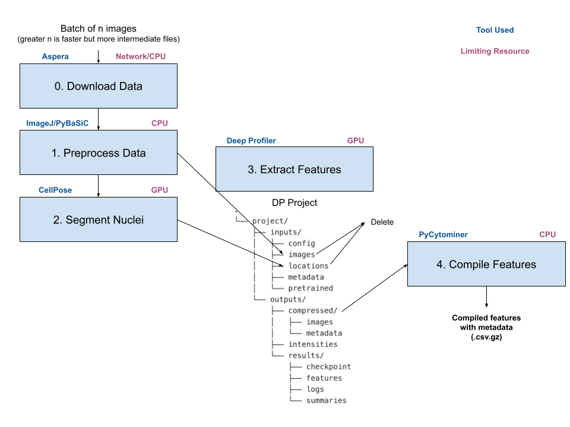

# idrstream

Software for feature extraction from IDR image data!

`example.ipynb` - All positive/negative control wells from Mitocheck mitosis movies (idr0013 - Screen A).
Wells A1 are excluded because of irregular illumination (see [mitocheck data preprocessing](https://github.com/WayScience/mitocheck_data/tree/main/1.preprocess_data)).

Stream info:
- 6743 images (frame 50 from 6743 wells)
- batch_size 10
- start_batch 1
- batches 675

Run 1:
- Error for batches 35, 105, 255: `'str' object has no attribute 'values'` (ImageJ not able to read downloaded CH5 movie).
All other batches were processsed.
- 9.8 GB for compressed 672 batches.
- ~ 2000 minutes run time - 1.4 days

No errors while rerunning batches 35, 105, 255 so error is most likely caused by `preprocess` being called slightly too soon (mitosis movie has not been completed saved so ImageJ is not able to read to downloaded data).
In future maybe implement wait or check to see if downloaded file has been completely saved.

## About

Idrstream is a package for deriving features associated with metadata from medical image data hosted on [IDR](https://idr.openmicroscopy.org/).

It uses the following tools to process data:

- [Aspera](https://www.ibm.com/products/aspera) high-speed transfer client is used to download IDR data.
More details can be found on the [IDR website](https://idr.openmicroscopy.org/about/download.html) and in setup/usage sections.
- [Fiji](https://imagej.net/software/fiji/) is used with [PyImagej](https://github.com/imagej/pyimagej) to read mitosis movies, which are hosted on IDR in [CellH5](https://github.com/CellH5/cellh5) format.
- [BaSiCPy](https://github.com/peng-lab/BaSiCPy) is used to perform illumination correction on images.
BaSiCPy is the python implementation of the BaSiC method for illumination correction, introduced in [Peng, T et al., 2020](https://doi.org/10.1007/978-3-030-59722-1_17).
- [CellPose](https://github.com/mouseland/cellpose) is used to segment nuclei from mitosis movies.
CellPose was first introduced in [Stringer, C., Wang, T., Michaelos, M. et al., 2020](https://doi.org/10.1038/s41592-020-01018-x).
- [DeepProfiler](https://github.com/cytomining/DeepProfiler) is used to extract features from mitosis movies. 
- [PyCytominer](https://github.com/cytomining/pycytominer) is used to compile DeepProfiler-extracted features with their metadata. 

The stream processes image data in the following pipeline:

The stream is set up as follows:

1) Create the temporary final data directories (if they don't already exist).
A Deep Profiler (DP) project folder is also created in the temporary directory.
2) Initialize downloader.
The Aspera downloader needs to be initialized with information about Aspera and the screens being downloaded (see setup and usage for more information).
3) Initialize preprocessor.
The ImageJ preprocessor needs to be initalized with information about ImageJ (see setup and usage for more information).
4) Initialize segmentor.
The CellPose segmentor needs to be intialized with information about the CellPose model specifications (see setup and usage for more information).
5) Create the base DP project folders/files.
Every DP batch run will use 2 files: config and checkpoint (examples in [example_files/DP_files](example_files/DP_files)).
These files are copied to their necessary folders in the DP project and will not be deleted until the stream is complete.
In other words, these are the only files that persist in the temporary directory for the entirety of a stream.
6) Start the stream.
The stream is given a batch size that corresponds to how many images the stream should process in each batch.
A DP project is run for each batch and the locations and images for each DP run are saved as intermediate files.
The larger the batch size, the faster a stream will complete (DP will not need to be initialized as often).
However, a larger batch size also corresponds to more intermediate files and more memory being allocated at once by DP (step 3) and PyCytominer (step 4).

Once a stream is set up, it processes each batch as follows:
1) Download a movie to temporary directory (step 0).
2) Find desired frame(s) and perform illumination correction.
Save desired frame(s) in DP project (step 1).
3) Find nuclei locations in desired frame(s) and save these nuclei locations in DP project (step 2).
4) Compile an `index.csv` file for the batch.
Each DP run needs this file to understand the metadata (plate, well, pertubation) associated with the image.
Save `index.csv` file in DP project (step 2.5).
5) Profile all images in batch with DeepProfiler.
Features from this DP run are saved in DP project (step 3).
6) Compile features from a batch and associate the metadata with features.
Compiled features with metadata are saved to the final data directory (step 4).
7) Delete all intermediate files from batch run and run next batch!

## Setup

## Usage

